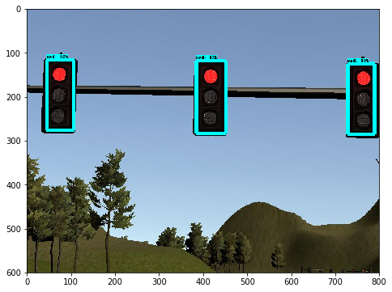
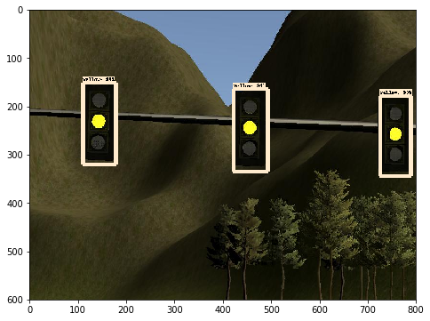
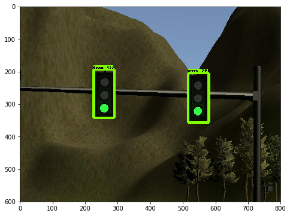
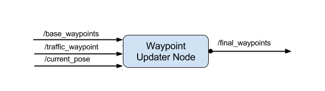

# Captone Project - Team BetterLateThanNever

## Team Members
| Name                          | Contact e-mail         | Role       |
| ----------------------------- | :--------------------- |:-----------|
| Razvan Itu                    | itu.razvan@gmail.com   | Perception |
| Harry Wang                    | wangharr@gmail.com     | Perception |
| Saurabh Bagalkar              | sbagalka@asu.edu       | Planning   |
| Vijayakumar Krishnaswamy      | kvijay.krish@gmail.com | Planning   |
| Vilas Chitrakaran (Team Lead) | cvilas@gmail.com       | Control    |

## Implementation Details

### Executive Summary

This project implements a basic pipeline for autonomous highway driving obeying traffic lights along the way. The system architecture is as follows:


As a team we were able to get all the individual modules working on their own and wire them up correctly. However, we were unable to resolve latencies in the pipeline due to camera image data and its processing in the traffic light classifier. Therefore, the light classification lags behind, causing the simulated car to not stop immediately ahead of the lights. The car eventually stops after a significant overshoot on our test machines (we do not have GPU enabled machines).

### Perception

#### Traffic Light Detection
The traffic light detection logic is in the detector node (`ros/src/tl_detector/tl_detector.py`). The purpose of this node is to alert the vehicle when it's approaching a red light. Specifically, the detector node subscribes to the `/current_pose` and `/base_waypoints` topics and uses a global list of traffic light coordinates to determine if it's approaching a traffic light, i.e. under 80 meters. We believe this is appropriate since at 42mph, or 19m/s, this gives the vehicle about 4 seconds to come to a complete stop if the traffic light is red. 

The vehicle receives a steady stream of camera images from its front-facing camera, and once it's determined that the vehicle is approaching a traffic light, the detector node then uses a classifier (`ros/src/tl_detector/tl_classifier.py`) to draw bounding boxes of traffic lights in the image and determine their colors. This information will then be published via the `/traffic_waypoint` topic of which the waypoint updater node subscribes to.


#### Traffic Light Classifier

We used the TensorFlow Object Detection API to train the Faster R-CNN model to classify traffic light state. The classifier itself is implemented in `tl_classifier.py`. Here are some example results from the classifier.

| Red | Amber | Green |
|------|------|-------|
|  |  |  |


### Planning

The eventual purpose of this node is to publish a fixed number of waypoints ahead of the vehicle with the correct target velocities. Depending on traffic lights the velocity is set. This node subscribes to the `/base_waypoints`, `/current_pose`,  and `/traffic_waypoint` topics, and publishes a list of waypoints ahead of the car with target velocities to the `/final_waypoints` topic as shown below:



The Wapoints update funtion is implemented in the `waypoint_updater.py` file.

### Control

The controller module sends desired steering angle, throttle and brake commands to the car.  


The control logic is implemented in `dbw_node.py`. A standard PID controller was implemented in `twist_controller.py` 
for generating throttle and brake commands, and a pre-existing steering controller provided in the repo was used for 
generating steering commands. Throttle and steering angle limits set by parameter files are obeyed by the controller. 
This node also correctly handles toggle between manual/auto modes.
 
# Original README

This is the project repo for the final project of the Udacity Self-Driving Car Nanodegree: Programming a Real Self-Driving Car. For more information about the project, see the project introduction [here](https://classroom.udacity.com/nanodegrees/nd013/parts/6047fe34-d93c-4f50-8336-b70ef10cb4b2/modules/e1a23b06-329a-4684-a717-ad476f0d8dff/lessons/462c933d-9f24-42d3-8bdc-a08a5fc866e4/concepts/5ab4b122-83e6-436d-850f-9f4d26627fd9).

Please use **one** of the two installation options, either native **or** docker installation.

### Native Installation

* Be sure that your workstation is running Ubuntu 16.04 Xenial Xerus or Ubuntu 14.04 Trusty Tahir. [Ubuntu downloads can be found here](https://www.ubuntu.com/download/desktop).
* If using a Virtual Machine to install Ubuntu, use the following configuration as minimum:
  * 2 CPU
  * 2 GB system memory
  * 25 GB of free hard drive space

  The Udacity provided virtual machine has ROS and Dataspeed DBW already installed, so you can skip the next two steps if you are using this.

* Follow these instructions to install ROS
  * [ROS Kinetic](http://wiki.ros.org/kinetic/Installation/Ubuntu) if you have Ubuntu 16.04.
  * [ROS Indigo](http://wiki.ros.org/indigo/Installation/Ubuntu) if you have Ubuntu 14.04.
* [Dataspeed DBW](https://bitbucket.org/DataspeedInc/dbw_mkz_ros)
  * Use this option to install the SDK on a workstation that already has ROS installed: [One Line SDK Install (binary)](https://bitbucket.org/DataspeedInc/dbw_mkz_ros/src/81e63fcc335d7b64139d7482017d6a97b405e250/ROS_SETUP.md?fileviewer=file-view-default)
* Download the [Udacity Simulator](https://github.com/udacity/CarND-Capstone/releases).

### Docker Installation
[Install Docker](https://docs.docker.com/engine/installation/)

Build the docker container
```bash
docker build . -t capstone
```

Run the docker file
```bash
docker run -p 4567:4567 -v $PWD:/capstone -v /tmp/log:/root/.ros/ --rm -it capstone
```

### Port Forwarding
To set up port forwarding, please refer to the [instructions from term 2](https://classroom.udacity.com/nanodegrees/nd013/parts/40f38239-66b6-46ec-ae68-03afd8a601c8/modules/0949fca6-b379-42af-a919-ee50aa304e6a/lessons/f758c44c-5e40-4e01-93b5-1a82aa4e044f/concepts/16cf4a78-4fc7-49e1-8621-3450ca938b77)

### Usage

1. Clone the project repository
```bash
git clone https://github.com/udacity/CarND-Capstone.git
```

2. Install python dependencies
```bash
cd CarND-Capstone
pip install -r requirements.txt
```
3. Make and run styx
```bash
cd ros
catkin_make
source devel/setup.sh
roslaunch launch/styx.launch
```
4. Run the simulator

### Real world testing
1. Download [training bag](https://s3-us-west-1.amazonaws.com/udacity-selfdrivingcar/traffic_light_bag_file.zip) that was recorded on the Udacity self-driving car.
2. Unzip the file
```bash
unzip traffic_light_bag_file.zip
```
3. Play the bag file
```bash
rosbag play -l traffic_light_bag_file/traffic_light_training.bag
```
4. Launch your project in site mode
```bash
cd CarND-Capstone/ros
roslaunch launch/site.launch
```
5. Confirm that traffic light detection works on real life images
